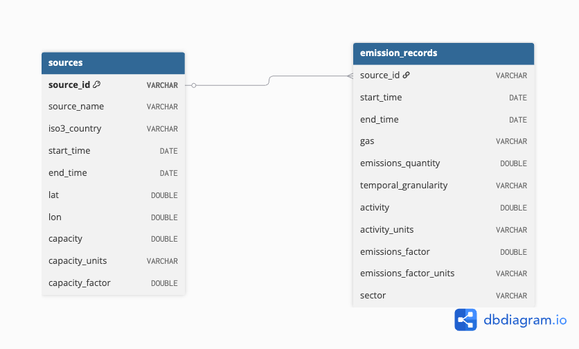

# CO₂ Emissions Database: U.S. Power and Non-Residential Building Emissions by County-Level Records


## Description

This repository houses a DuckDB database and analysis of CO₂ emissions intensity from non-residential buildings and power sources across US counties based on two datasets obtained from Climate TRACE. A relational database containing emission records across several county-level jurisdictions was created to relate source metadata (location and capacity) with monthly CO₂ emissions quantities. This relational database was used to calculate and visualize CO₂ intensity (tons CO₂/m²/year) to identify the highest-emitting jurisdictions in the U.S.

## Repository Structure 
```
├── data-cleaning.ipynb        # Data cleaning and table preparation
├── data-visualization.ipynb   # CO₂ intensity visualization
├── data
│   └── new_tables             # Loaded sources.csv and emissions_records.csv
├── database
│   └── my-db.duckdb           # Relational database
│   └── co2-query.sql          # SQL query for CO₂ intensity analysis
│   └── database-creation.sql  # SQL schema and data loading
├── eds-213-labs.Rproj         
├── environment.yml            # Conda environment dependencies
├── figs                       # Output figures
├── LICENSE
├── README.md
└── requirements.txt           # Python dependencies
```
## Database Schema



**Note:** `emission_records` uses a composite primary key of `source_id-start_time-gas` to uniquely identify each emission record.

## Data Access
The data used in the creation of this relational database is not housed in this repository. [Climate TRACE](https://climatetrace.org/data) provides publicly accessible emissions data across sectors, countries, cities, and subnational inventories worldwide. Consult the [Climate TRACE methodology](https://github.com/climatetracecoalition/methodology-documents) for additional information regarding spatial methodology for building emissions estimation.

| Sector | Description |
|---|---|
| [Power](https://downloads.climatetrace.org/latest/country_packages/co2/USA.zip) | Electricity generation emissions (CO₂) |
| [Non-Residential Buildings](https://downloads.climatetrace.org/latest/country_packages/co2/USA.zip) | On-site fuel usage emissions, excluding electricity (CO₂) |


## Reproducibility 
Steps to reproduce the analysis are included below: 
1. Clone repository.
2. Install dependencies using `environment.yml`.
3. Download the U.S. CO₂ emissions data from Climate TRACE and store the files in `data/`:
   - `non-residential-onsite-fuel-usage_emissions_sources_v5_5_0.csv`
   - `electricity-generation_emissions_sources_v5_5_0.csv`
4. Run `data-cleaning.ipynb` to clean the data and export `sources.csv` and `emission_records.csv` to `data/new_tables/`.
5. Run `database/build-my-database.sql` to create the database and load the cleaned tables.
6. Run `data-visualization.ipynb` to reproduce the analysis and visualizations.

## Contributors
This repository is maintained by Vedika Shirtekar as part of the Master of Environmental Data Science program at UC Santa Barbara. This work was completed for the [EDS 213: Databases and Data Management](https://ucsb-library-research-data-services.github.io/bren-eds213/) course at the Bren School of Environmental Science and Management, which provided data access and documentation practices, as well as assignment instructions.

## References
[1] Climate TRACE. (2025). *U.S. CO₂ Emissions by Source* [Dataset]. Climate TRACE. Accessed May 14, 2026, from 
https://climatetrace.org/data 

[2] EDS 213. (n.d.). Databases and Data Management. Bren School of Environmental Science and Management. Accessed May 12, 2026, from https://ucsb-library-research-data-services.github.io/bren-eds213/
